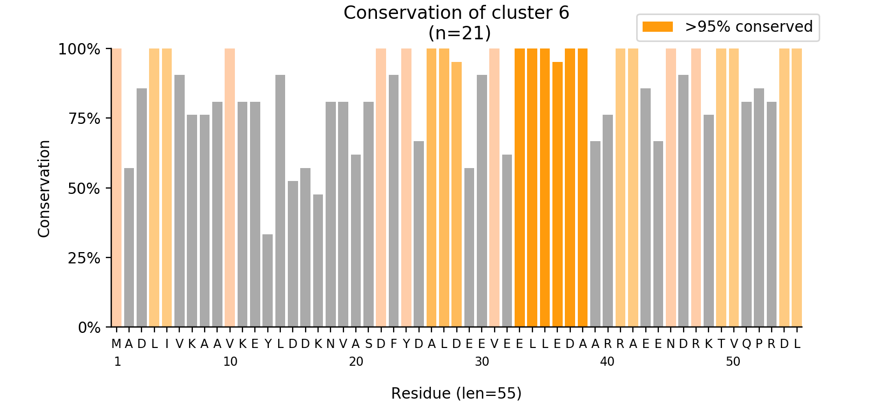

# How diverse are archaeal histones?
## Goal
Try to figure out how many different types of histones exist in archaea so that we can study representative that will describe how histones work generally in archaea. We can't do this phylogenetically as relationships in archaea are hard to define and break down because billions of years of sequence divergance has impeded our ability to find reliable genetic markers.
## Approach 
(see jupyter notebook archaeal_histone_diversity.ipynb)
To look at the diversity of histones in archaea we need to:
0. Collect all archaeal proteins (took 11 hours).
>use fetch_archaeal_proteins.q
1. Download hmm-profile to search against.
>use can download PF00125_seed.sto from pfam.org
build hmm-profile using build_hmm_profile.sh
1. Identify which proteins are histones using hmmsearch.
>use hmmsearch.sh
>get file of just accession numbers with parse_hits.py
2. Make multifasta including all the histones.
>download the histone hits with fetch_archaeal_hits.q
3. Create database having gene name, sequence, length, pI, and helical propensity.
>use plot_standard.py archaeal_histones_20191211.fa

4. Use sklearn or dbscan to cluster proteins.
>use plot_kmeans.py archaeal_histones_20191211.fa
(n_clusters = 8 as a first pass)

>try to find right number of clusters using plot_kmeans_elbows.py archaeal_histones_20191211.fa

>looks like 5, go 3D 

>KMeans clustering might not be the best way, try DBSCAN
>use plot_dbscan.py archaeal_histones_20191211.fa

>output files containing multifastas of each cluster of histones using output_cluster_files.py
5. Use half_blast to identify doublet proteins.
>go to github.com/shla9937/half_blast (need to make a submodule)
>use half_blast.py to idenfity doublet histones
6. Evaluate each cluster:
>align clusters with MUSCLE (could probably write a python script to do this)
>go to github.com/shla9937/histone_gram (could also make this a submodule)
>Using plot_histone_gram_ungapped.py to vizualize proteins in each of the clusters

## Continuing development
To make this analysis better:
0. Use a workflow management tool like snakemake to streamline analysis.
1. Do analysis on DBSCAN parameters to find optimal conditions.
2. Half Blast:
    1. Make run in parallel.
    2. Run Blast locally.
    3. Optimize thresholding.
3. Evaluting histone clusters:
    1. Find average or median protein from each cluster.
    2. See what are the characteristic of each group.
    3. Figure out which phyla are represented in each cluster.
4. Implement more tests to ensure the scripts are robust.
    
## Summary
Although this is a preliminary analysis, I think I have found some good leads on proteins to study. This DBSCAN suggests 7 clusters of histones, at least two of which are thought to be real histones. I've previously identified one of the other clusters. Cluster 5 is an interesting protein, as it looks like doublet histone connected to something else, interesting... This analysis could be used to explore the diversity of other archaeal proteins, mainly the protein Alba, which is thought to have a similar role to that of histones.

